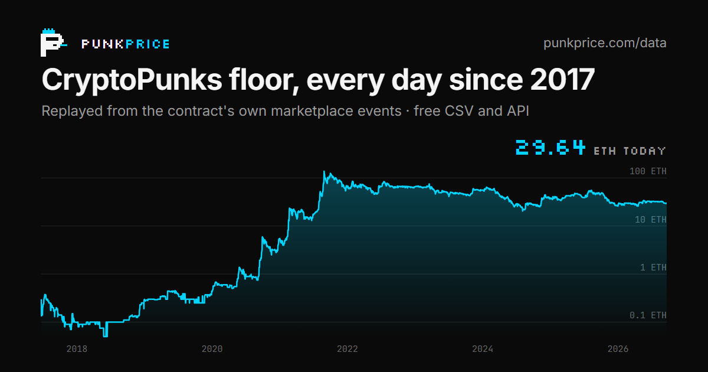

# CryptoPunks daily floor price, 2017 to today

The daily CryptoPunks floor from **23 June 2017** onwards, rebuilt from the CryptoPunks
marketplace contract's own events. One row per UTC day, no gaps, updated every day.



- **Chart and downloads:** [punkprice.com/data](https://punkprice.com/data?utm_source=github)
- **Licence:** [CC BY 4.0](LICENSE). Use it for anything, including commercially, as long as you credit it (see [Cite](#cite))

## Quick start

```python
import pandas as pd

floor = pd.read_csv(
    "https://raw.githubusercontent.com/ZonnetjeAXIOM/cryptopunks-floor/main/data/cryptopunks-daily-floor.csv",
    parse_dates=["date"],
)
```

The same data is served live, with no API key, at
`https://punkprice.com/api/data/floor-history.csv` and `.../floor-history.json`.

## Files

| File | Rows | What |
|---|---|---|
| [`data/cryptopunks-daily-floor.csv`](data/cryptopunks-daily-floor.csv) | one per day since 2017-06-23 | The floor series |
| [`data/pnkstr-daily-premium.csv`](data/pnkstr-daily-premium.csv) | one per day since Sep 2025 | PunkStrategy (PNKSTR) market cap against its treasury of punks and ETH |
| [`datapackage.json`](datapackage.json) | | Machine-readable schema ([Frictionless](https://frictionlessdata.io/)) |
| [`dune/cryptopunks-daily-floor.sql`](dune/cryptopunks-daily-floor.sql) | | The same series recomputed in SQL from raw `ethereum.logs` on Dune |
| [`verify/verify-floor.mjs`](verify/verify-floor.mjs) | | Checks any day against the contract's own state |

### `cryptopunks-daily-floor.csv`

| Column | Meaning |
|---|---|
| `date` | UTC calendar day, `YYYY-MM-DD` |
| `floor_eth` | Lowest public ask standing at 23:59:59 UTC, in ETH |
| `floor_punk_index` | The punk offered at that price (on ties, one of them) |
| `active_asks` | All open offers on the contract at that moment, public and private |
| `source` | `onchain-orderbook` if the contract saw marketplace activity that day, `onchain-carried` if the previous day's order book stood unchanged |

### `pnkstr-daily-premium.csv`

`premium_x` = `pnkstr_market_cap_usd` ÷ `asset_fmv_usd`, where the treasury value is punks
held × that day's floor × ETH/USD plus unallocated ETH × ETH/USD. The other columns are the
inputs. Token prices come from CoinGecko; treasury balances and transfers come from the chain.

## Method

CryptoPunks predates ERC-721 and has its own marketplace built into the contract
([`0xb47e3cd8…93bbb`](https://etherscan.io/address/0xb47e3cd837ddf8e4c57f05d70ab865de6e193bbb)).
That marketplace is where the floor is set.

1. Replay every `PunkOffered`, `PunkNoLongerForSale`, `PunkBought` and `PunkTransfer` event
   since the contract's genesis block (about 240,000 events), in block and log order.
2. An offer stays open until the next event for the same punk: a new offer replaces it, and
   a withdrawal, sale or transfer clears it. This is exactly what the contract does.
3. The floor for a day is the **lowest public ask open at the end of that UTC day**. Offers
   reserved for one buyer (`toAddress` set) are excluded, because nobody else can take them.

Nothing is estimated, interpolated or taken from an aggregator.

**Limits.** This is the floor on the CryptoPunks contract's own marketplace. Wrapped punks
listed on other marketplaces are not included. A floor is an ask, not a trade.

## Verification

- **Against contract state.** [`verify/verify-floor.mjs`](verify/verify-floor.mjs) reads
  `punksOfferedForSale` for all 10,000 punks at the last block of a day from an archive
  node and compares the result with this dataset. No API key is needed.
  ```sh
  cd verify && npm install && node verify-floor.mjs 2024-01-11 2022-12-01
  ```
- **In SQL.** [`dune/cryptopunks-daily-floor.sql`](dune/cryptopunks-daily-floor.sql)
  derives the series independently from raw logs. Its logic reproduces all 3,378 days
  exactly.
- **Against cryptopunks.app.** The official site also charts a daily floor. The two series
  agree exactly on about three days in four. On 24 of 24 disputed days we checked, the
  contract's own state matched this dataset. Most of the difference is a flat 59 ETH that
  series shows from June 2022 to April 2023, when the cheapest punk actually offered cost
  more on all but one day. Details: [punkprice.com/data#methodology](https://punkprice.com/data?utm_source=github#methodology).

## Updates

A GitHub Action pulls the latest rows from punkprice.com every day at 00:30 UTC, after the
nightly sync, and commits them if anything changed.

## Cite

> PunkPrice (2026). *CryptoPunks daily floor price, reconstructed from the CryptoPunks marketplace contract.* https://punkprice.com/data

GitHub's **"Cite this repository"** button (from [`CITATION.cff`](CITATION.cff)) gives the
same citation in APA and BibTeX.

## Licence

Data: [Creative Commons Attribution 4.0 International](LICENSE). The verification script
and SQL are offered under the same terms.
